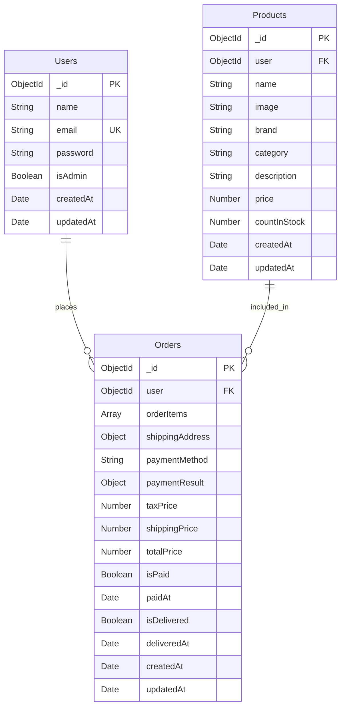

# Zappify Shoes 👟

Zappify is a full-stack premium shoe e-commerce platform available on both **Web** and **Mobile (Android)**. It offers a seamless shopping experience — from browsing 44+ curated shoe collections to placing orders, tracking deliveries, and managing your account — all in one place.

Built with a modern MERN stack on the backend and React + React Native on the frontend, Zappify is designed for performance, clean UI, and real-world usability.

## Live Demo

- **Website:** [zappify-sepia.vercel.app](https://zappify-sepia.vercel.app)
- **Download APK:** [Zappify Android App](https://expo.dev/accounts/devendra.mi/projects/zappify/builds/24237286-1ff7-4219-ac7a-6c103ff28d00)

---

## Technology Stack


---

## Architecture Diagram

```
+-------------------------------------------------------------------+
|                                                                   |
|  +-------------+      +-------------+      +-------------+        |
|  |  Front-end  |      |  Back-end   |      |  Database   |        |
|  |   ReactJS   |<---->|   NodeJS    |<---->|  MongoDB    |        |
|  |UI Components|      |  ExpressJS  |      | Collections |        |
|  | API calls   |      |API endpoints|      |  Documents  |        |
|  +-------------+      +-------------+      +-------------+        |
|                                                                   |
+-------------------------------------------------------------------+
```

---

## Database Schema



---

## Payment Testing

Razorpay is integrated in test mode. Use these credentials to test payments:

| Method | Details |
|---|---|
| Card | 5267 3181 8797 5449 / Expiry: 08/26 / CVV: 123 / OTP: 1234 |
| UPI | success@razorpay |

---

## What This Project Does

Zappify is built as a real-world e-commerce application that covers the complete shopping journey:

- A user lands on the site, browses 44+ premium shoe listings
- Filters by category, theme, or searches by name
- Views product details with size chart and adds to cart
- Logs in via email/password or Google OAuth
- Goes through a 3-step checkout (Bag → Address → Payment)
- Tracks their order with a live timeline
- Can cancel an order with a reason

---

## Main Features

### For Users
- Browse 44+ premium shoe listings
- Filter by category and theme
- Sort by price and new arrivals
- Search products by name, brand or category
- Product detail page with size selection and UK Size Chart
- Add to cart with size validation
- Wishlist toggle on product cards and detail page
- 3-step checkout - Bag to Address to Payment (COD / UPI / Card)
- Razorpay payment gateway integration (UPI, Card, Netbanking, Wallet)
- Payment signature verification on backend
- Order history with tracking timeline
- Order cancellation with reason selection form
- Google OAuth 2.0 login
- Normal email/password sign up and sign in
- User-specific order history per account
- Persistent login via localStorage
- Progressive Web App (PWA) ready

### For Admins
- Secure JWT-protected API routes
- Admin middleware for role-based access
- Create and manage product listings via REST API

---

## Getting Started

### What You Need
- Node.js 18+
- MongoDB (local or Atlas)

### Installation

1. Clone the repo
```bash
git clone https://github.com/Mishra-coder/Zappify.git
cd Zappify
```

2. Backend setup
```bash
cd backend
npm install
```

Create `backend/.env`:
```env
PORT=5001
MONGO_URI=your_mongodb_uri
JWT_SECRET=your_secret_key
NODE_ENV=development
RAZORPAY_KEY_ID=your_razorpay_key_id
RAZORPAY_KEY_SECRET=your_razorpay_key_secret
```

```bash
npm run dev
```

3. Frontend setup
```bash
cd frontend
npm install
npm run dev
```

4. Mobile setup
```bash
cd mobile
npm install
npx expo start
```

App opens at http://localhost:5173

---

## Project Structure

```
Zappify/
├── .github/workflows/
├── frontend/
│   ├── public/shoes/
│   └── src/
│       ├── components/
│       ├── data/products.js
│       ├── App.jsx
│       ├── main.jsx
│       └── index.css
├── mobile/
│   ├── src/
│   │   ├── components/
│   │   ├── context/
│   │   ├── data/
│   │   ├── screens/
│   │   └── theme/
│   └── App.js
└── backend/
    ├── config/db.js
    ├── controllers/
    ├── middlewares/
    ├── models/
    ├── routes/
    └── server.js
```

---

## API Endpoints

| Method | Endpoint | Description | Auth |
|---|---|---|---|
| POST | /api/users | Register user | No |
| POST | /api/users/login | Login user | No |
| GET | /api/products | Get all products | No |
| GET | /api/products/:id | Get product by ID | No |
| POST | /api/products | Create product | Admin |
| POST | /api/payment/create-order | Create Razorpay order | No |
| POST | /api/payment/verify | Verify payment signature | No |

---

## Frontend Environment Variables

Create `frontend/.env`:
```env
VITE_API_URL=http://localhost:5001
VITE_RAZORPAY_KEY_ID=your_razorpay_key_id
```

---

## CI/CD & Testing

- GitHub Actions pipeline runs on every push and pull request
- Linting with ESLint on both frontend and backend
- Unit tests with Jest for email validation logic
- Integration tests with Jest + Supertest for API routes
- E2E tests with Cypress simulating real user flows (homepage, search, cart, login)
- Automated deployment to AWS EC2 via SSH on every push to main
- Dependabot configured for weekly dependency updates

Run backend tests:
```bash
cd backend
npm test
```

Run E2E tests:
```bash
cd frontend
npm run cy:open
```

---

## AWS EC2 Deployment

Backend is also deployed on AWS EC2 with PM2 process manager.

- EC2 instance: `13.218.101.177:5001`
- PM2 keeps the server alive and auto-restarts on crash
- GitHub Actions auto-deploys on every push to main

---

## Docker

```bash
docker build -t zappify-backend ./backend
docker run -p 5001:5001 zappify-backend
```

---

## Author

Devendra Mishra - [@Mishra-coder](https://github.com/Mishra-coder)

---

Built with love for Zappify Shoes
