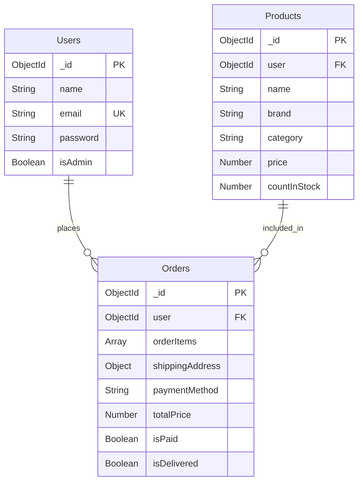

# Zappify Shoes

A complete full-stack e-commerce shoe store built with React and Node.js.

## Technology Stack

                

---

## Architecture Diagram

```
+-------------------------------------------------------------------+
|                                                                   |
|  +-------------+      +-------------+      +-------------+       |
|  |  Front-end  |      |  Back-end   |      |  Database   |       |
|  |   ReactJS   |<---->|   NodeJS    |<---->|  MongoDB    |       |
|  |UI Components|      |  ExpressJS  |      | Collections |       |
|  | API calls   |      |API endpoints|      |  Documents  |       |
|  +-------------+      +-------------+      +-------------+       |
|                                                                   |
+-------------------------------------------------------------------+
```

---

## Database Schema



---

## What This Project Does

Zappify is a full-featured shoe e-commerce platform where users can browse 44+ premium shoe collections, filter and search products, manage their cart and wishlist, go through a complete 3-step checkout, and track or cancel their orders.

---

## Main Features

### For Users
- Browse 44+ premium shoe listings
- Filter by category and theme
- Sort by price and new arrivals
- Search products by name, brand or category
- Product detail page with size selection and UK Size Chart
- Add to cart with size validation
- Wishlist toggle on product cards and detail page
- 3-step checkout - Bag to Address to Payment (COD / UPI / Card)
- Order history with tracking timeline
- Order cancellation with reason selection form
- Google OAuth 2.0 login
- Normal email/password sign up and sign in
- User-specific order history per account
- Persistent login via localStorage

### For Admins
- Secure JWT-protected API routes
- Admin middleware for role-based access
- Create and manage product listings via REST API

---

## Getting Started

### What You Need
- Node.js 18+
- MongoDB (local or Atlas)

### Installation

1. Clone the repo
```bash
git clone https://github.com/Mishra-coder/Zappify.git
cd Zappify
```

2. Backend setup
```bash
cd backend
npm install
```

Create `backend/.env`:
```env
PORT=5001
MONGO_URI=your_mongodb_uri
JWT_SECRET=your_secret_key
NODE_ENV=development
```

```bash
npm run dev
```

3. Frontend setup
```bash
cd frontend
npm install
npm run dev
```

App opens at http://localhost:5173

---

## Project Structure

```
Zappify/
├── .github/workflows/
├── frontend/
│   ├── public/shoes/
│   └── src/
│       ├── components/
│       ├── data/products.js
│       ├── App.jsx
│       ├── main.jsx
│       └── index.css
└── backend/
    ├── config/db.js
    ├── controllers/
    ├── middlewares/
    ├── models/
    ├── routes/
    └── server.js
```

---

## API Endpoints

| Method | Endpoint | Description | Auth |
|---|---|---|---|
| POST | /api/users | Register user | No |
| POST | /api/users/login | Login user | No |
| GET | /api/products | Get all products | No |
| GET | /api/products/:id | Get product by ID | No |
| POST | /api/products | Create product | Admin |

---

## Docker

```bash
docker build -t zappify-backend ./backend
docker run -p 5001:5001 zappify-backend
```

---

## Author

Devendra Mishra - [@Mishra-coder](https://github.com/Mishra-coder)

---

Built with love for Zappify Shoes
